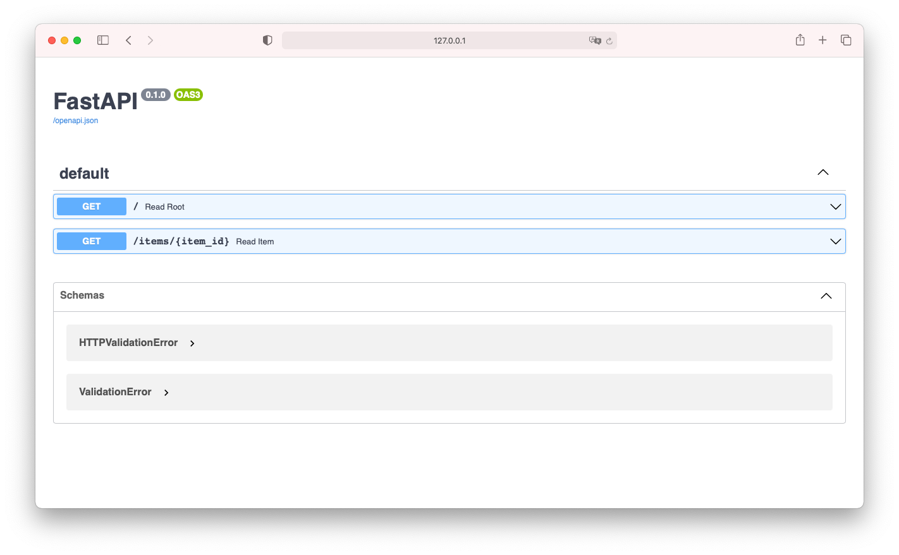
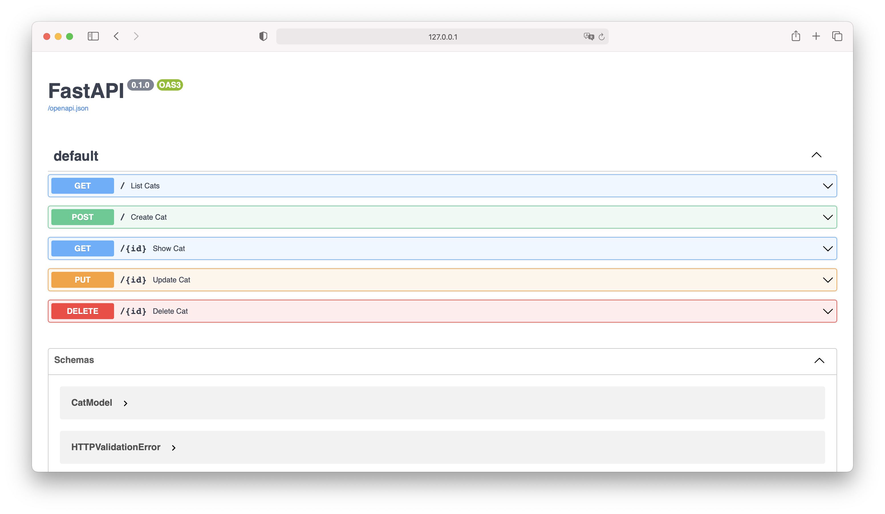

## The python FastAPI framework

Within a few steps it's possible to create an API that is controlled by the **URL** and to work with the information in JSON format.

Also included in the framework is a automatic API-documentation:  */docs*



And it's also possible to write the API as an __asynchronous__ application

## The idea of asynchrony in python:

Fast application need smart programming, in order to get for example a server application that can handle the needs of different parts of a program, different modules or functions that need to wait the results of each other, that's what asynchronous programming is for.

In python the syntax for it are the **coroutines** in the module **asyncio**:

**async** and **await**

__async__ marks the methods as asynchronous methods, __await__ is the checkpoint where one function can go to another.

The difference between **threads** and **coroutines** is: By using threads the operating system decides to switch to another task. Coroutines only switches when there is an "await".  

## Implementing a MongoDB database into FastAPI framework



There are a few parts to take care of to write a MongoDB with a FastAPI framework.  
My first small [example API](./cat/app.py) is a initial attempt, a small modification of [this](https://github.com/mongodb-developer/mongodb-with-fastapi#readme) source code, I will go through the code step by step and illuminate and understand the individual components.
1. Connection:

For the connection purpose it is using the [**motor**](https://motor.readthedocs.io/en/stable/) API:

```python
app = FastAPI()
client = motor.motor_asyncio.AsyncIOMotorClient(os.environ["MONGODB_URL"])
db = client.catworld
```

The **MONGODB_URL** environment string is the connection string. It looks like this:

```
"mongodb+srv://<username>:<password>@<url>/<db>?retryWrites=true&w=majority"
```

But just to try it out, this string can be used:

```
"mongodb://localhost:270172"
```
2. Data validation with pydantic:

FastAPI uses the [**pydantic**](https://pydantic-docs.helpmanual.io) library to review and process the data. It's a quick, but easy-to-use package. To create a pydantic model to use it in FastAPI a self-created Class has to inherit the pydantic **BaseModel**:

```Python
from pydantic import BaseModel, Field
from typing import Optional, List

class CatModel(BaseModel):
    id: PyObjectId = Field(default_factory=PyObjectId, alias="_id")
    # It's something special going on with PyObjectId ... more later
    catname: str = Field(...)
    skill: str = Field(...)
    strength: float = Field(..., le=4.0)

```
The propertys of CatModel are surrounded with [__type annotations__](https://docs.python.org/3/library/typing.html#module-typing). Type annotations in python **are not effecting the compiler or runtime**, there will be no error caused of missmatching the annotations, maybe this could be missleading. Rather they are notes in the code for developers.

The syntax is:

```Python
# For variables:
<variablename>: <type>
# For functions:
def <functionname>(<parameter>) -> <type>:
# Type annotations are hints what type is required for the variable
# or what kind of return-type of a function is expected

```

## So what does pydantic?

Pydantic converts data in python format, in this case: It attempts to coerce it in the annotated type. There is also the possibility to mark the type of the model as __Optional__ or to provide default values. And it provides very detailed error messages:

This code:

```Python
from pydantic import BaseModel, Field, ValidationError
from typing import Optional, List
from BSON import ObjectId

class PyObjectId(ObjectId):
    @classmethod
    def __get_validators__(cls):
        yield cls.validate

    @classmethod
    def validate(cls, v):
        if not ObjectId.is_valid(v):
            raise ValueError("Invalid objectid")
        return ObjectId(v)

    @classmethod
    def __modify_schema__(cls, field_schema):
        field_schema.update(type="string")


class CatModel(BaseModel):
    id: PyObjectId = Field(default_factory=PyObjectId, alias="_id")
    catname: str = Field(...)
    skill: str = Field(...)
    strength: float = Field(..., le=4.0)

try:
    cat = CatModel(catname='Waltraud', skill='Fight with Axes', strength='She can prevail')
    print(cat)
except ValidationError as e:
    print(e.json())
```

Comes to this output:

```Python

[
  {
    "loc": [
      "strength"
    ],
    "msg": "value is not a valid float",
    "type": "type_error.float"
  }
]

```

And now to the **PyObjectId** class:
The PyObjectId inherits from **BSONs ObjectId** let's take a closer look in it.

## [BSON's ObjectId](https://docs.mongodb.com/manual/reference/method/ObjectId/):

ObjectId is an extremely clever data type from the Mongo database. It not only guarantees unique IDs, but also saves the creation date, as a timestamp, in the same pass with in the ObjectId.

[Here](https://BSONspec.org/spec.html) is the specification of BSON in a pseudo-BFN syntax.
This element of the BSON document has a size of 12 byte.

The ObjectId also has a property the __timestamp__ that is reachable with the:

```Python
bson.objectid.ObjectId.generation_time
```

and also a __validation method__ that checks if the given string is a valid ObjectId or not:

```Python
bson.objectid.ObjectId.is_valid(str)
```
[Look](#so-what-does-pydantic) upwards in the code there in the PyObjectId this particular ObjectId-method is found inside the **validate-method**.


[\@classmethod](https://docs.python.org/3/library/functions.html#classmethod) is a decorator:
[The difference between classmethod and staticmethod:](./classmeth_vs_staticmeth.md)
The classmethod passes a **class object** instead of a **class instance** (explict: _self_)


## Creating an own pydantic data type:

There a few ways to create a own datatype. For the case of **ObjectId** it's really important, because there is no pythonic datatype like this.

A type that can be build, for that reason uses FastAPI at least three decorated methods:

```python
__get_validators__()
__modify_schema__()
validate()

```
Let's have again a deepeer look into the CatModel example:

```python

class PyObjectId(ObjectId):
    @classmethod
    def __get_validators__(cls):
        yield cls.validate
        # This will yield the proper validate methods

    @classmethod
    def validate(cls, v):
        if not ObjectId.is_valid(v):
            raise ValueError("Invalid objectid")
        return ObjectId(v)
        # This will be used to validate the value in the way we want it to be
        # It returns an object:
        # An ObjectId-object that will be stored as PyObjectId

    @classmethod
    def __modify_schema__(cls, field_schema):
        field_schema.update(type="string")
        # Here the field_schema-dict is updated to the type: 'string'


class CatModel(BaseModel):
    id: PyObjectId = Field(default_factory=PyObjectId, alias="_id")
    # The default factory is used in case no value is given
    # The PyObjectId inherits from ObjectId from pymongos bson that creates a
    # ObjectId by calling the class:
    #
    # >>> from bson import ObjectId
    # >>> ObjectId()
    # ObjectId('61095187da5556bd5cc9a4f7')
    #
    #
    catname: str = Field(...)
    # To declare a field as required, you may declare it using just an annotation,
    # or you may use an ellipsis (...) as the value
    skill: str = Field(...)
    strength: float = Field(..., le=4.0)
```
'...' is the literal for the special value _Ellipsis_ a build-in constant of python.
'A(s) non-used literal, you can use the ellipsis object.'
'So if you see yourself in the situation that you are developing a new tool or library and need a placeholder literal, remind yourself of the ellipsis object!' Quotes from Florian Daliz: [What is Python's Ellipsis Object?](https://florian-dahlitz.de/articles/what-is-pythons-ellipsis-object)


## The **Config**-sub-class of pydantics **BaseModel**:

```python
class Config:
      allow_population_by_field_name = True
      arbitrary_types_allowed = True
      json_encoders = {ObjectId: str}
      schema_extra = {
          "example": {
              "catname": "Kitty Lilly",
              "skill": "Drinks Seawater, Knows How To Deal With Hairballs",
              "strength": "13.0",
          }
      }
```
